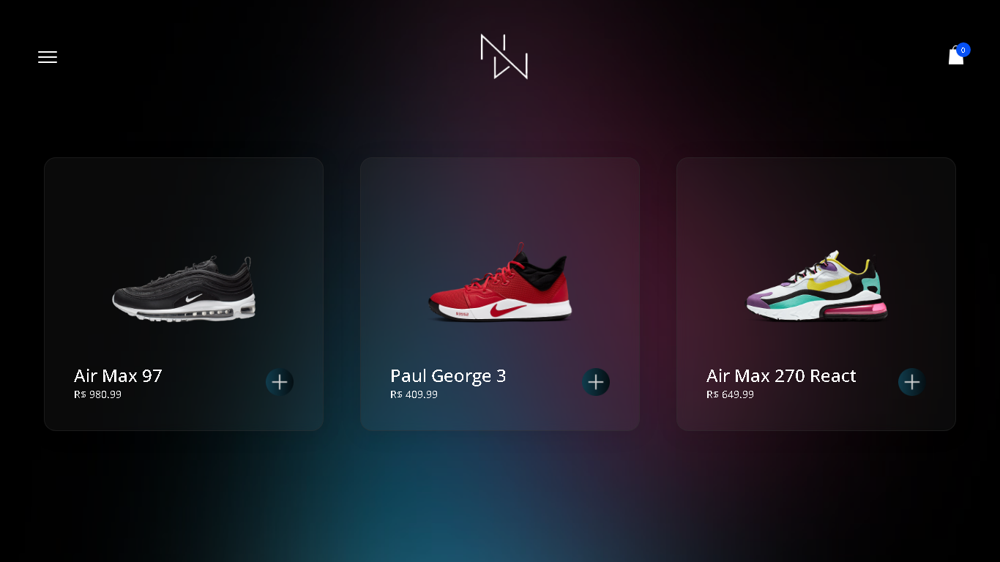
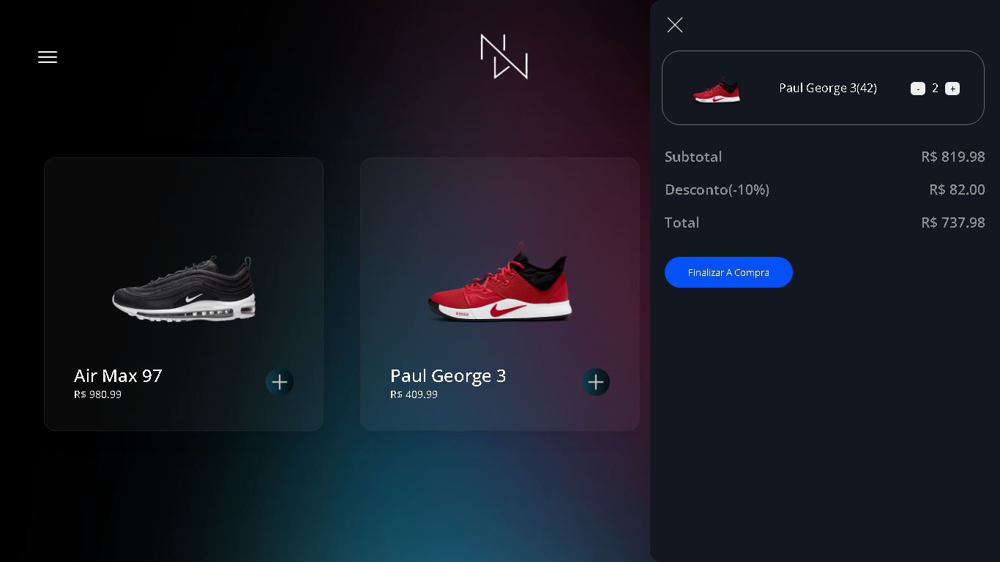
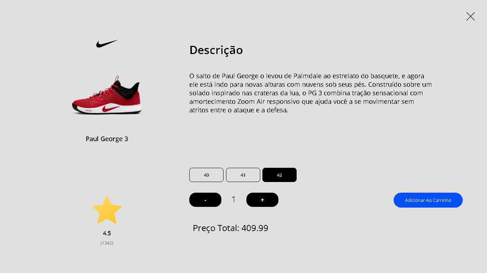
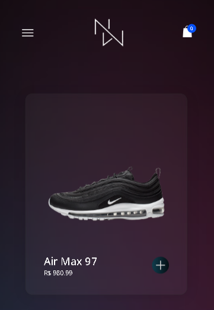
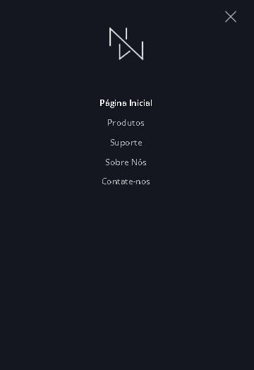
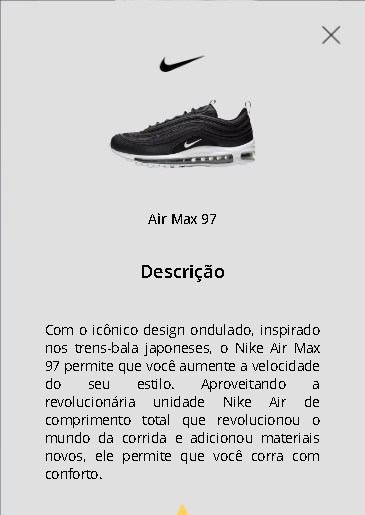
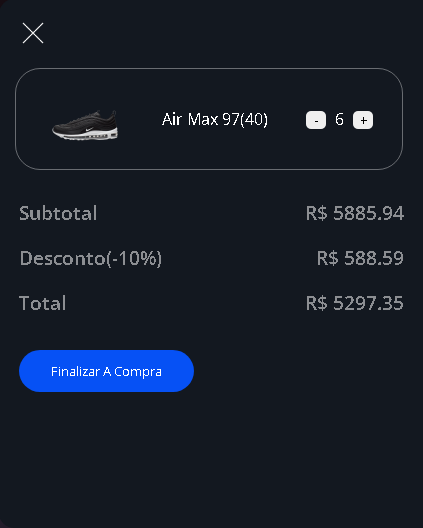

## 👀 Overview

Mini e-commerce criado a partir do conhecimento adquirido em meu curso, moderno e com algumas animações totalmente criado a partir de manipulação de DOM.

<h2 align="center">Desktop</h3>
 
<h2 align="center">Desktop - Menu</h3>
 
<h2 align="center">Desktop - Cart</h3>
 
<h2 align="center">Desktop - Modal</h3>
 
<h2 align="center">Mobile</h3>
 
<h2 align="center">Mobile - Menu</h3>
 
<h2 align="center">Mobile - Modal 1</h3>
 
<h2 align="center">Mobile - Modal 1.1</h3>
 
<h2 align="center">Mobile - Cart</h3>
 

## 💡 Ideia 

O projeto foi criado a partir dos conhecimentos que conquistei no meu curso, o intuito foi praticar manipulações de DOM e JSON. Com isso, criei um mini e-commerce de tênis com algumas animais e uma biblioteca com animações em vanilla, ele está totalmente funcional e responsivo mas não possui telas ou APIs de Checkout.

## ⚙️ Tools

 - HTML
 - CSS
 - JAVASCRIPT
 - [vanillatilt](https://github.com/gijsroge/tilt.js)

 
 

## 🚀 Future
  

### Código

Penso em implementar alguma API de checkout assim como a tela para a mesma, e outras telas. Eu sinceramente acho que esse projeto ficaria melhor em React por isso que iria fazer algo inspirado nisso em futuro próximo

 
 

 
 
 
<h3 align="center"> Criado com muito ❤️ por <a href="https://github.com/VBrianB"> Vinicius Brian Bolzani</a></h2>
